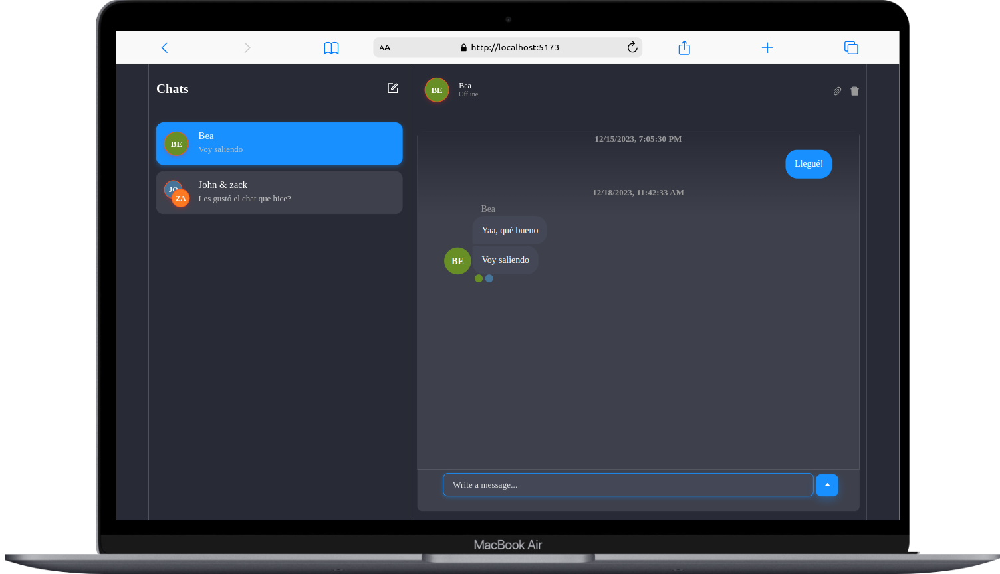
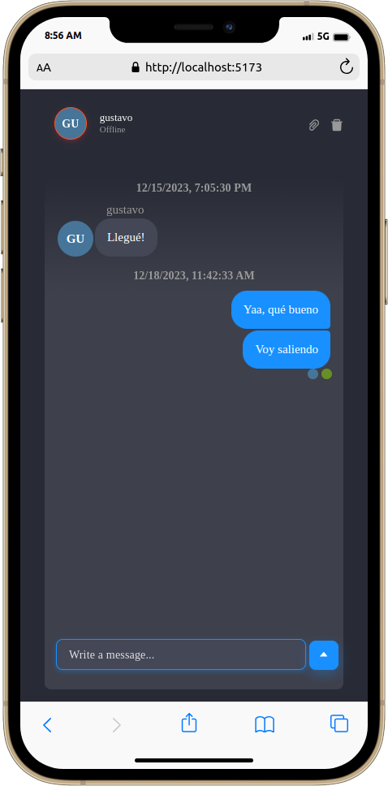

# Chat project 💬

In my quest to create an engaging and fast chat experience, I came across a powerful tool known as Chat Engine. Using Node.js for the backend and React for the frontend, I incorporated Chat Engine into this project, simplifying the process of creating an elegant and responsive chat app.

## Demo

### PC Chat


### Mobile Chat



## Features

- **User-Friendly Interface:** Crafted with a clean and intuitive UI, ensuring a seamless user experience.
  
- **Speedy Performance:** Leverage the power of Node.js for a robust backend, resulting in a fast and efficient chat application.

## Getting Started

Follow these steps to quickly set up and launch your own chat application:

1. **Clone the Repository:**
   ```bash
   git clone https://github.com/gustavoselman/Chat-Engine
   ```

2. **Backend Setup:**
   ```bash
   cd backend
   npm install
   npm start
   ```

3. **Frontend Setup:**
   
   _Move to root directory:_
   ```bash
   cd frontend
   npm install
   npm run dev
   ```

4. **Open in Browser:**

   Open your browser and visit the URL that appears in the terminal.

## Built With

- [React](https://reactjs.org/) - Frontend framework
- [Node.js](https://nodejs.org/en/) - Backend environment
- [Chat Engine](https://chatengine.io/) - Chat API
